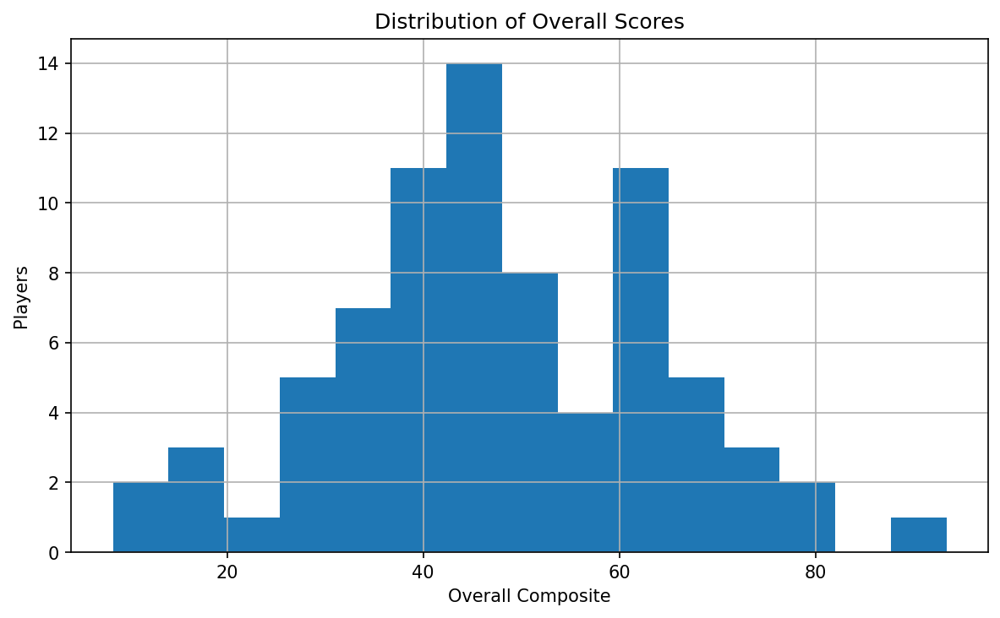
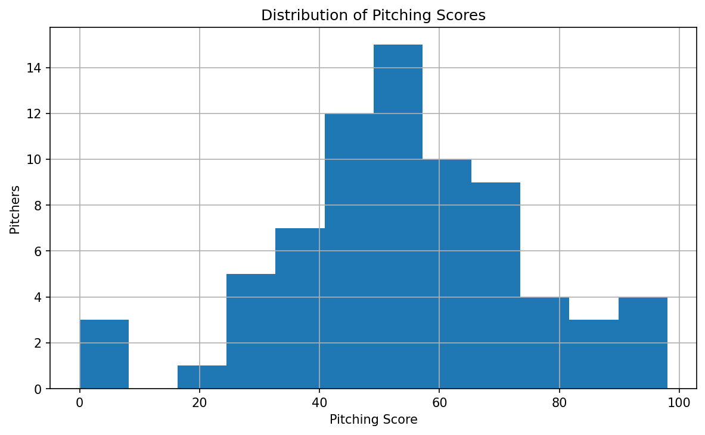
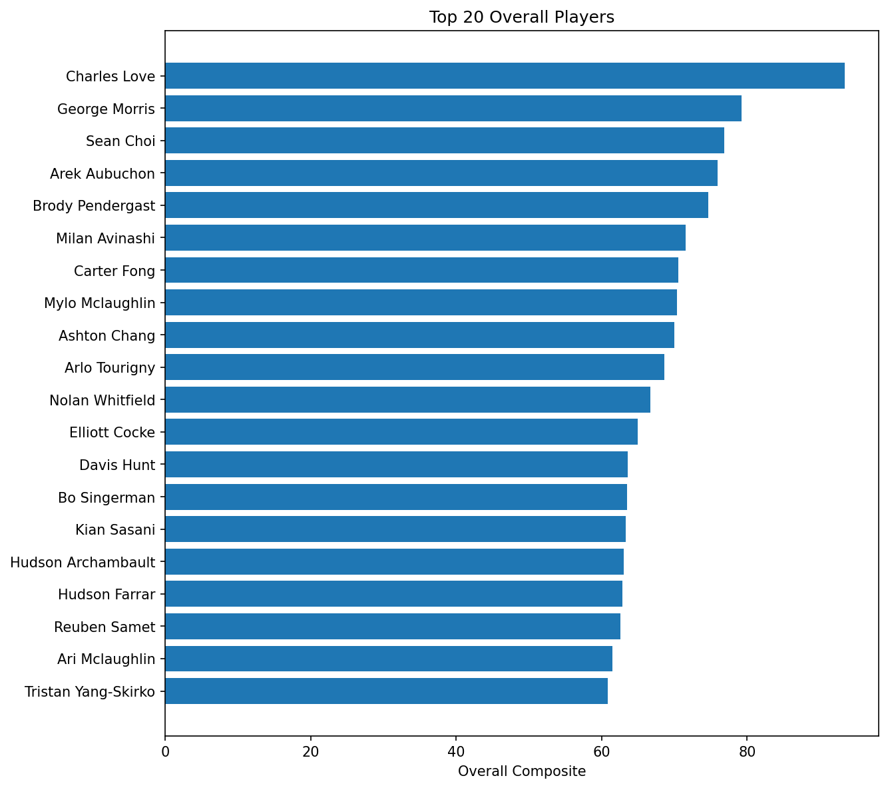
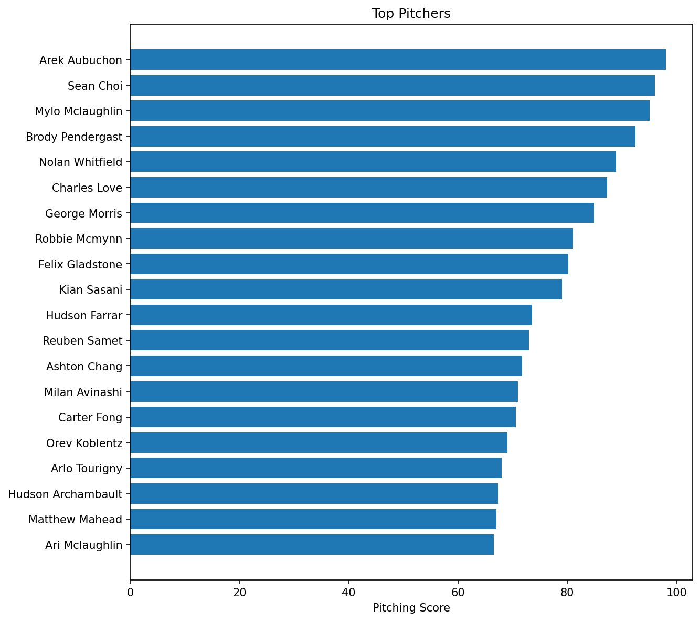
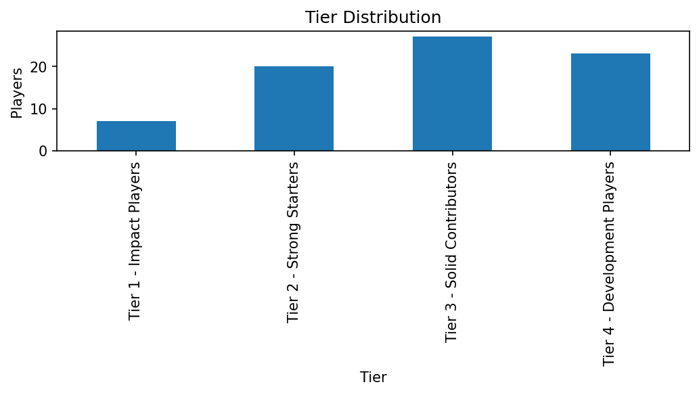
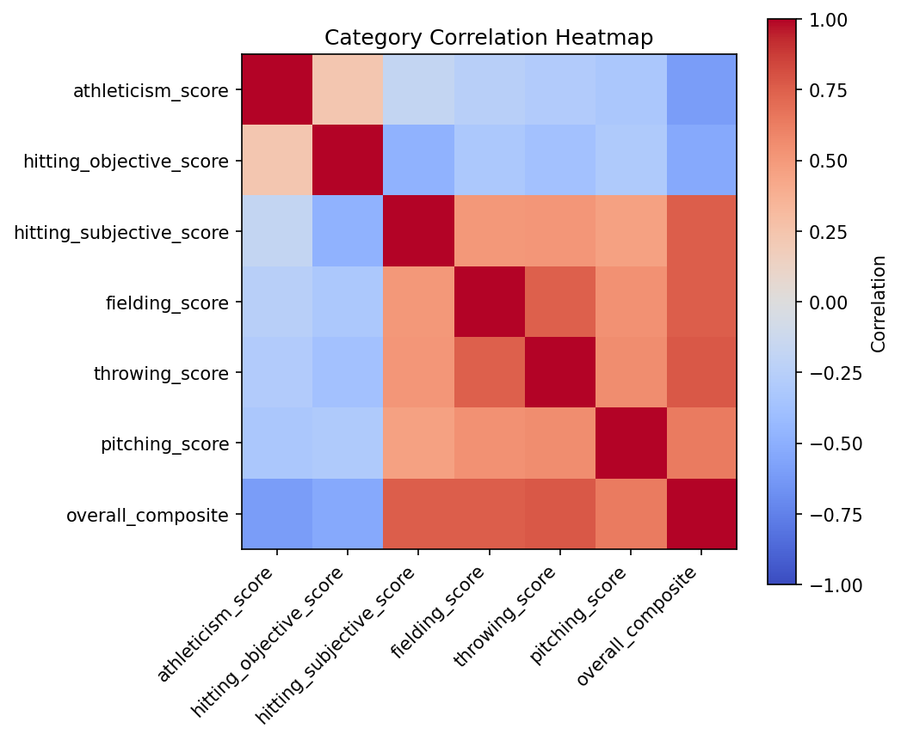
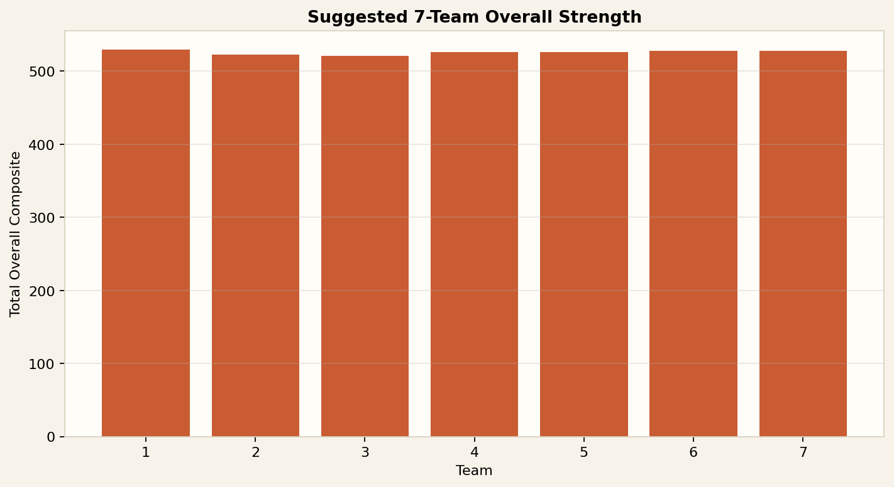
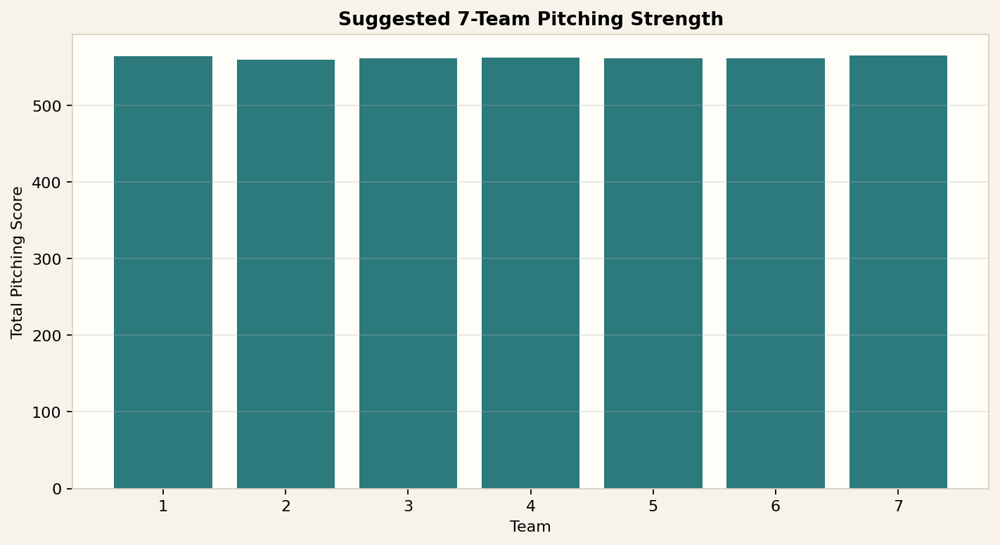

# VCB 13U House Draft Analysis

This repo contains a corrected player analysis workflow for the `VCB House - 13u PeeWee Assessment.xlsx` workbook, a coach-facing PDF report, and a suggested balanced 7-team build.

Primary deliverables:

- [analysis_pipeline.py](/Users/eugenelin/dev/vcb13u/analysis_pipeline.py)
- [analysis_notebook.ipynb](/Users/eugenelin/dev/vcb13u/analysis_notebook.ipynb)
- [draft_board.csv](/Users/eugenelin/dev/vcb13u/draft_board.csv)
- [draft_summary_report.md](/Users/eugenelin/dev/vcb13u/draft_summary_report.md)
- [vcb_13u_draft_infographic_report.pdf](/Users/eugenelin/dev/vcb13u/vcb_13u_draft_infographic_report.pdf)
- [suggested_balanced_7_teams.csv](/Users/eugenelin/dev/vcb13u/suggested_balanced_7_teams.csv)

## Workbook Structure

- 4 sheets total
- 77 unique players in the full pool
- 73 players with pitching-specific data
- 4 players missing pitching-specific data: `Bo Singerman`, `Elliott Cocke`, `Luca Di Nozzi`, `Shael Singerman`
- The ranking sheets are not tidy raw tables and require custom parsing because they contain title rows and embedded headers

## Visual Overview

### Overall Score Distribution



### Pitching Score Distribution



### Top 20 Overall Players



### Top Pitchers



### Tier Distribution



### Category Correlation Heatmap



### Suggested 7-Team Overall Strength



### Suggested 7-Team Pitching Strength



## Draft Model Summary

The analysis keeps pitching value separate from overall player value and builds four ranking lenses:

- `raw_score_model`: weighted direct scoring from athleticism, hitting, fielding, throwing, and pitching components
- `normalized_score_model`: z-score based comparison across categories
- `balanced_player_model`: rewards fewer weak spots across the player profile
- `specialist_upside_model`: rewards standout tools and ceiling

Use the board like this:

- `Overall Rank` for best available
- `Pitcher Rank` when you need to prioritize arms
- `Balanced Score` when choosing between similar tiers
- `Upside Score` when choosing between floor and ceiling
- `Top 3 Strengths` and `Risk / Weakness Flag` for fast tie-breakers

## Top 10 Overall Players

| Player Name | Overall Rank | Pitcher Rank | Tier | Top 3 Strengths | Risk / Weakness Flag |
| --- | --- | --- | --- | --- | --- |
| Charles Love | 1 | 6 | Tier 1 - Impact Players | Throwing, Pitching Tool, Athleticism | Pitching depth, Defensive polish |
| George Morris | 2 | 7 | Tier 1 - Impact Players | Athleticism, Fielding, Throwing | Pitching depth, Defensive polish |
| Sean Choi | 3 | 2 | Tier 1 - Impact Players | Athleticism, Throwing, Fielding | Pitching depth, Defensive polish |
| Arek Aubuchon | 4 | 1 | Tier 1 - Impact Players | Fielding, Hitting, Throwing | Pitching depth, Offensive impact |
| Brody Pendergast | 5 | 4 | Tier 1 - Impact Players | Throwing, Fielding, Athleticism | Pitching depth, Defensive polish |
| Milan Avinashi | 6 | 14 | Tier 1 - Impact Players | Athleticism, Pitching Tool, Fielding | Pitching depth, Defensive polish |
| Carter Fong | 7 | 15 | Tier 1 - Impact Players | Athleticism, Pitching Tool, Fielding | Pitching depth, Defensive polish |
| Mylo Mclaughlin | 8 | 3 | Tier 1 - Impact Players | Athleticism, Throwing, Fielding | Pitching depth, Defensive polish |
| Ashton Chang | 9 | 13 | Tier 1 - Impact Players | Athleticism, Pitching Tool, Throwing | Pitching depth, Defensive polish |
| Arlo Tourigny | 10 | 17 | Tier 1 - Impact Players | Fielding, Throwing, Hitting | Pitching depth, Offensive impact |

## Hidden-Value And Role-Fit Players

These are players whose board value improved in alternate models or whose strengths make them more useful than a simple raw rank might suggest.

| player_name | tier | value_delta | top_3_strengths | risk_flag |
| --- | --- | --- | --- | --- |
| Oliver Lewis | Tier 3 - Solid Contributors | 25 | Athleticism, Pitching Tool, Hitting | Defensive polish |
| Armann Freimanis | Tier 3 - Solid Contributors | 14 | Throwing, Hitting, Athleticism | No major flag from data |
| River Yonge | Tier 3 - Solid Contributors | 12 | Pitching Tool, Hitting, Throwing | Defensive polish |
| Dylan Bansback | Tier 3 - Solid Contributors | 10 | Pitching Tool, Athleticism, Fielding | Offensive impact |
| Shael Singerman | Tier 3 - Solid Contributors | 9 | Fielding, Throwing, Hitting | High variance profile |
| Gray Dickson | Tier 3 - Solid Contributors | 9 | Fielding, Pitching Tool, Throwing | High variance profile |
| Francis De La Cruz | Tier 2 - Strong Starters | 7 | Throwing, Fielding, Hitting | High variance profile |
| Mylo Mclaughlin | Tier 1 - Impact Players | 5 | Athleticism, Throwing, Fielding | Pitching depth, Defensive polish |
| Tristan Yang-Skirko | Tier 2 - Strong Starters | 5 | Pitching Tool, Throwing, Fielding | Defensive polish, Offensive impact |
| Douglas Ritchie | Tier 3 - Solid Contributors | 5 | Hitting, Fielding, Pitching Tool | No major flag from data |

## Suggested Balanced 7-Team Build

This build uses all 77 players as 7 teams of 11 and tries to minimize the spread in overall strength, pitching strength, and top-end talent concentration.

### Team Summary

| team | players | overall_strength | pitching_strength | avg_overall_rank |
| --- | --- | --- | --- | --- |
| 1 | 11 | 529.3 | 564.0 | 41.4 |
| 2 | 11 | 523.1 | 559.2 | 37 |
| 3 | 11 | 521.3 | 561.0 | 39.9 |
| 4 | 11 | 526.3 | 561.9 | 38.4 |
| 5 | 11 | 526.1 | 561.6 | 38.3 |
| 6 | 11 | 527.8 | 561.8 | 38.6 |
| 7 | 11 | 528.1 | 564.7 | 39.5 |

## Team 1

| player_name | overall_rank | pitcher_rank | tier | top_3_strengths |
| --- | --- | --- | --- | --- |
| Charles Love | 1 | 6 | Tier 1 - Impact Players | Throwing, Pitching Tool, Athleticism |
| Nolan Whitfield | 11 | 5 | Tier 2 - Strong Starters | Throwing, Athleticism, Hitting |
| Kian Sasani | 15 | 10 | Tier 2 - Strong Starters | Athleticism, Hitting, Fielding |
| Michelle Morrison | 29 | 21 | Tier 3 - Solid Contributors | Athleticism, Pitching Tool, Fielding |
| Aaron Franken | 42 | 68 | Tier 3 - Solid Contributors | Pitching Tool, Athleticism, Throwing |
| River Yonge | 52 | 65 | Tier 3 - Solid Contributors | Pitching Tool, Hitting, Throwing |
| Arun Soni | 53 | 48 | Tier 3 - Solid Contributors | Fielding, Hitting, Throwing |
| Shael Singerman | 54 |  | Tier 3 - Solid Contributors | Fielding, Throwing, Hitting |
| Liam Fagan | 57 | 40 | Tier 3 - Solid Contributors | Fielding, Hitting, Throwing |
| Peyton Lee | 70 | 50 | Tier 4 - Development Players | Hitting, Fielding, Throwing |
| Stefan Jerinic | 71 | 52 | Tier 4 - Development Players | Athleticism, Hitting, Throwing |

## Team 2

| player_name | overall_rank | pitcher_rank | tier | top_3_strengths |
| --- | --- | --- | --- | --- |
| George Morris | 2 | 7 | Tier 1 - Impact Players | Athleticism, Fielding, Throwing |
| Davis Hunt | 13 | 25 | Tier 2 - Strong Starters | Athleticism, Pitching Tool, Fielding |
| Hudson Archambault | 16 | 18 | Tier 2 - Strong Starters | Fielding, Throwing, Hitting |
| Hayden Gudewill | 23 | 30 | Tier 2 - Strong Starters | Athleticism, Pitching Tool, Throwing |
| Ari Edgar | 26 | 24 | Tier 2 - Strong Starters | Throwing, Hitting, Fielding |
| Sasha Zvijerac | 31 | 36 | Tier 3 - Solid Contributors | Pitching Tool, Athleticism, Throwing |
| Quinn Mclelan | 34 | 45 | Tier 3 - Solid Contributors | Athleticism, Pitching Tool, Fielding |
| Douglas Ritchie | 44 | 31 | Tier 3 - Solid Contributors | Hitting, Fielding, Pitching Tool |
| Emerick Johnson | 69 | 69 | Tier 4 - Development Players | Pitching Tool, Hitting, Throwing |
| Easton Ferris | 72 | 59 | Tier 4 - Development Players | Athleticism, Hitting, Pitching Tool |
| Basim Azou | 77 | 71 | Tier 4 - Development Players | Hitting, Athleticism, Pitching Tool |

## Team 3

| player_name | overall_rank | pitcher_rank | tier | top_3_strengths |
| --- | --- | --- | --- | --- |
| Arek Aubuchon | 4 | 1 | Tier 1 - Impact Players | Fielding, Hitting, Throwing |
| Mylo Mclaughlin | 8 | 3 | Tier 1 - Impact Players | Athleticism, Throwing, Fielding |
| Elliott Cocke | 12 |  | Tier 2 - Strong Starters | Athleticism, Hitting, Throwing |
| Jack Cheyne | 28 | 33 | Tier 3 - Solid Contributors | Athleticism, Pitching Tool, Throwing |
| Oran Lavigne | 30 | 23 | Tier 3 - Solid Contributors | Throwing, Hitting, Fielding |
| Logan Ng | 41 | 35 | Tier 3 - Solid Contributors | Athleticism, Hitting, Pitching Tool |
| Ethan Grange | 50 | 41 | Tier 3 - Solid Contributors | Throwing, Fielding, Hitting |
| Nam Phan | 63 | 60 | Tier 3 - Solid Contributors | Athleticism, Pitching Tool, Throwing |
| Gray Dickson | 64 | 62 | Tier 3 - Solid Contributors | Fielding, Pitching Tool, Throwing |
| Caleb Huh | 66 | 38 | Tier 4 - Development Players | Hitting, Athleticism, Throwing |
| Kyle Foster | 73 | 70 | Tier 4 - Development Players | Pitching Tool, Hitting, Athleticism |

## Team 4

| player_name | overall_rank | pitcher_rank | tier | top_3_strengths |
| --- | --- | --- | --- | --- |
| Sean Choi | 3 | 2 | Tier 1 - Impact Players | Athleticism, Throwing, Fielding |
| Tristan Yang-Skirko | 20 | 43 | Tier 2 - Strong Starters | Pitching Tool, Throwing, Fielding |
| Matthew Mahead | 25 | 19 | Tier 2 - Strong Starters | Fielding, Throwing, Hitting |
| Philip Dawe | 32 | 56 | Tier 3 - Solid Contributors | Pitching Tool, Fielding, Throwing |
| Liam Redden | 36 | 64 | Tier 3 - Solid Contributors | Fielding, Pitching Tool, Hitting |
| Henry Brown | 38 | 44 | Tier 3 - Solid Contributors | Athleticism, Fielding, Pitching Tool |
| Dylan Bansback | 43 | 58 | Tier 3 - Solid Contributors | Pitching Tool, Athleticism, Fielding |
| Liam Pearce | 47 | 66 | Tier 3 - Solid Contributors | Pitching Tool, Throwing, Fielding |
| Frederick "Freddy" Pragnell | 49 | 31 | Tier 3 - Solid Contributors | Fielding, Athleticism, Hitting |
| Armann Freimanis | 55 | 28 | Tier 3 - Solid Contributors | Throwing, Hitting, Athleticism |
| Daxton Stutters | 74 | 53 | Tier 4 - Development Players | Athleticism, Hitting, Throwing |

## Team 5

| player_name | overall_rank | pitcher_rank | tier | top_3_strengths |
| --- | --- | --- | --- | --- |
| Brody Pendergast | 5 | 4 | Tier 1 - Impact Players | Throwing, Fielding, Athleticism |
| Reuben Samet | 18 | 12 | Tier 2 - Strong Starters | Fielding, Hitting, Throwing |
| Ari Mclaughlin | 19 | 20 | Tier 2 - Strong Starters | Athleticism, Fielding, Pitching Tool |
| Francis De La Cruz | 24 | 26 | Tier 2 - Strong Starters | Throwing, Fielding, Hitting |
| Bowie Scott | 33 | 46 | Tier 3 - Solid Contributors | Pitching Tool, Throwing, Hitting |
| Donovan Hayes | 35 | 55 | Tier 3 - Solid Contributors | Throwing, Pitching Tool, Hitting |
| Henry Galer | 39 | 29 | Tier 3 - Solid Contributors | Athleticism, Hitting, Fielding |
| Oliver Lewis | 46 | 34 | Tier 3 - Solid Contributors | Athleticism, Pitching Tool, Hitting |
| Jonathan Bick | 60 | 63 | Tier 3 - Solid Contributors | Pitching Tool, Throwing, Hitting |
| Ryder Everingham | 67 | 67 | Tier 4 - Development Players | Fielding, Pitching Tool, Hitting |
| Levi Milnes | 75 | 73 | Tier 4 - Development Players | Athleticism, Pitching Tool, Fielding |

## Team 6

| player_name | overall_rank | pitcher_rank | tier | top_3_strengths |
| --- | --- | --- | --- | --- |
| Milan Avinashi | 6 | 14 | Tier 1 - Impact Players | Athleticism, Pitching Tool, Fielding |
| Ashton Chang | 9 | 13 | Tier 1 - Impact Players | Athleticism, Pitching Tool, Throwing |
| Arlo Tourigny | 10 | 17 | Tier 1 - Impact Players | Fielding, Throwing, Hitting |
| Luca Di Nozzi | 22 |  | Tier 2 - Strong Starters | Athleticism, Hitting, Throwing |
| Orev Koblentz | 37 | 16 | Tier 3 - Solid Contributors | Athleticism, Hitting, Fielding |
| Felix Vandenenden | 45 | 38 | Tier 3 - Solid Contributors | Athleticism, Pitching Tool, Hitting |
| Lawrance Zhau | 48 | 22 | Tier 3 - Solid Contributors | Fielding, Hitting, Athleticism |
| Andre Morin | 51 | 36 | Tier 3 - Solid Contributors | Fielding, Athleticism, Hitting |
| Gyuin Lee | 59 | 27 | Tier 3 - Solid Contributors | Athleticism, Hitting, Throwing |
| Dylan Bobko | 62 | 47 | Tier 3 - Solid Contributors | Fielding, Hitting, Throwing |
| Tristan Edmunds | 76 | 72 | Tier 4 - Development Players | Hitting, Pitching Tool, Athleticism |

## Team 7

| player_name | overall_rank | pitcher_rank | tier | top_3_strengths |
| --- | --- | --- | --- | --- |
| Carter Fong | 7 | 15 | Tier 1 - Impact Players | Athleticism, Pitching Tool, Fielding |
| Bo Singerman | 14 |  | Tier 2 - Strong Starters | Throwing, Fielding, Hitting |
| Hudson Farrar | 17 | 11 | Tier 2 - Strong Starters | Athleticism, Fielding, Pitching Tool |
| Felix Gladstone | 21 | 9 | Tier 2 - Strong Starters | Throwing, Hitting, Fielding |
| Robbie Mcmynn | 27 | 8 | Tier 2 - Strong Starters | Hitting, Fielding, Throwing |
| Sebastian Yang-Skirko | 40 | 51 | Tier 3 - Solid Contributors | Fielding, Throwing, Hitting |
| Reegan Plummer | 56 | 53 | Tier 3 - Solid Contributors | Throwing, Pitching Tool, Athleticism |
| Dylan Armstrong | 58 | 42 | Tier 3 - Solid Contributors | Throwing, Hitting, Fielding |
| Angus Rohee | 61 | 49 | Tier 3 - Solid Contributors | Hitting, Throwing, Fielding |
| Hank Miller | 65 | 60 | Tier 4 - Development Players | Athleticism, Pitching Tool, Throwing |
| Andrew Macmillan | 68 | 57 | Tier 4 - Development Players | Athleticism, Hitting, Throwing |

## How To Re-Run

Local:

```bash
. .venv/bin/activate
python analysis_pipeline.py
python generate_pdf_report.py
```

Google Colab:

1. Upload `analysis_notebook.ipynb`
2. Upload `analysis_pipeline.py`
3. Upload `VCB House - 13u PeeWee Assessment.xlsx`
4. Run the notebook from top to bottom

## Notes And Limits

- No defensive positions were provided, so position-player value is role-agnostic
- Pitching-specific analysis excludes players with no pitching sheet data
- This is a draft-room support tool, not a substitute for coach knowledge, attendance reliability, or roster-fit context
